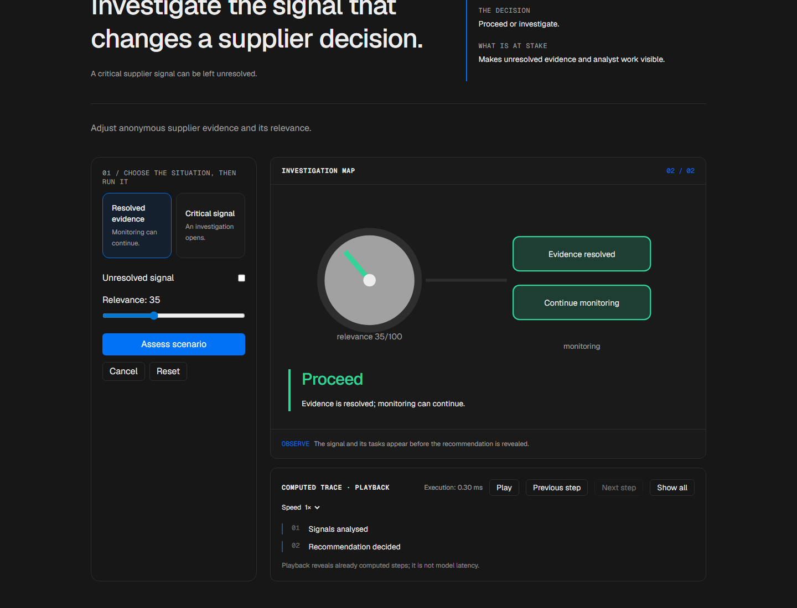
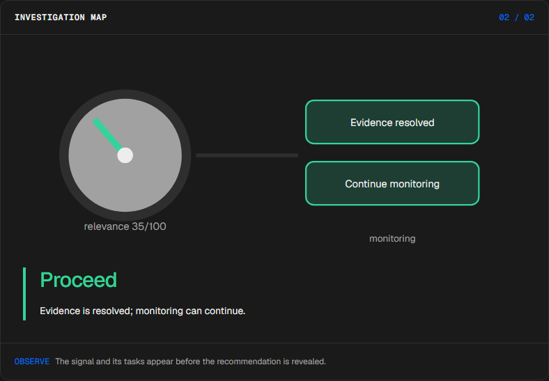
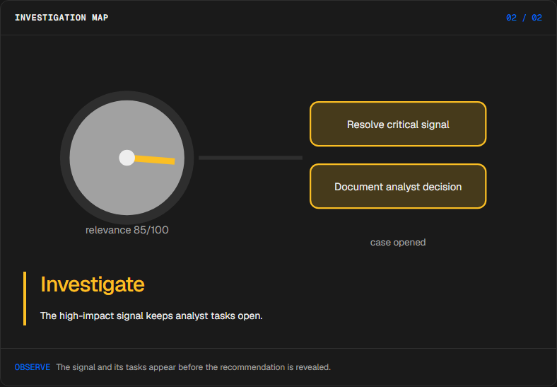
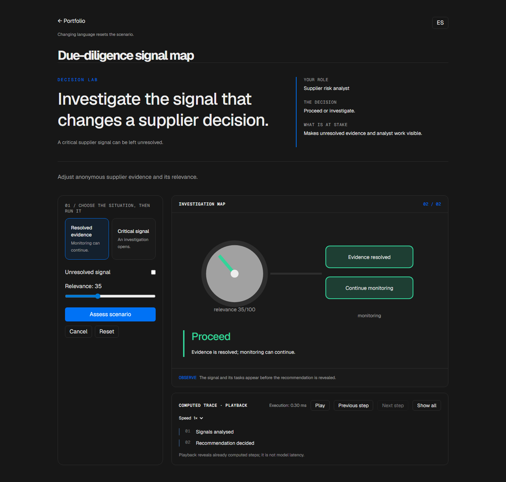

# Supplier due diligence

<!-- community-badges -->
[](https://github.com/mdeasis27/radar-proveedores/actions/workflows/ci.yml) [](LICENSE)
<!-- /community-badges -->

[Español](README.es.md) · [Try the demo](https://radar-proveedores-manueldeasis27-2515s-projects.vercel.app/en/app) · [Case study](https://manueldeasis.com/en/projects/radar-proveedores) · [Source](https://github.com/mdeasis27/radar-proveedores)



Adjust supplier signals and relevance weights to inspect a recommendation.

## Two situations to compare

**Resolved evidence:** unresolved=false, relevance=35 Monitoring continues.



**Critical signal:** unresolved=true, relevance=85 Investigation tasks remain open.



## Business use case

A critical supplier signal can be left unresolved.

**Who uses it:** Supplier risk analyst.

**The decision:** Proceed or investigate.

Inspect relevance, open or close tasks, then choose a monitoring route.

### Try the decision

**Resolved evidence:** unresolved=false, relevance=35 Monitoring continues.

**Critical signal:** unresolved=true, relevance=85 Investigation tasks remain open.

Choose a scenario, edit its controls and run the local computation. Step through the visual process or reveal all steps. Reset before comparing the second scenario.

## How to try it

Open `/en/app` (English, default) or `/es/app` (Spanish). Change the scenario inputs and run the computation. Inspect the resulting decision, evidence and computed trace. Playback reveals completed local steps; it does not measure a live model. Reset starts a new local scenario. Changing language resets the scenario; the interface displays a reset notice.

The primary demo needs no account, API key or database. Public links refer to the existing deployment; local redesign changes are pending publication.

## Local setup and verification

Requires Node.js 22 and pnpm 10.

```sh
pnpm install --frozen-lockfile
pnpm dev
pnpm test
node node_modules/typescript/bin/tsc --noEmit --incremental false
pnpm lint
pnpm build
```

Open `http://localhost:3000/en/app`. Recorded validation covers tests, lint, TypeScript and production builds. See [command results](docs/quality/decision-lab-verification.json) and [browser component checks](docs/quality/decision-lab-browser.json). The new browser checks exercise real React components and production CSS with controlled locale navigation; they do not certify Next routes or public deployment.

## Architecture

- `app/[lang]/`: localized browser experience.
- `lib/experience/`: typed local adapter, validation and run traces.
- `design-system/`: shared visual tokens, locale controls and execution/replay presentation.
- `app/api/`: optional server integrations; the primary demo does not require them.

Technology: Next.js 16, TypeScript, REST APIs, LLM API, Tailwind CSS v4.

## Evidence and limitations

A relevance dial connects the signal to live investigation tasks.

Anonymous scenario evidence mapped to risk and a decision checklist.

Makes unresolved evidence and analyst work visible.

**Limits:** Uses local fictional evidence only. These portfolio prototypes do not claim measured production impact.

Inputs use fictional or anonymized examples. Optional live integrations require their own credentials and operational setup. Secrets belong in the configured secret manager, never in local secret files or Git. Use the existing `infisical run -- <command>` workflow when live integration is needed. This repository does not publish or deploy automatically as part of the local demo.



<!-- community-section -->
## License and contributing

Released under the [MIT License](LICENSE). Issues and pull requests are welcome: read [CONTRIBUTING.md](CONTRIBUTING.md) and the [Code of Conduct](CODE_OF_CONDUCT.md) first. To report a vulnerability, see [SECURITY.md](SECURITY.md).
<!-- /community-section -->
